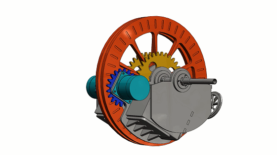
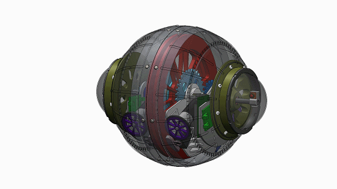

# Spherical-robot-machine-vision
---
* The spherical robot is a `reconnaissance robot`, so it needs to have a strong environment perception capability. The spherical robot is composed of two symmetrical flywheel mechanisms with cameras mounted on both sides. In this project, I focused on the panoramic stitching technique under binocular vision and the target detection technique under `HSV` color space. Following figures show the `3D design` and prototype of the robot.
---

  
  

  

  
* ### Prototype spherical robot

  

  
---

  
  

  
  

  
* ### Experiment on flat ground motion of spherical robot

  

 
---

  
  

    
  

  
* ### 3D model of a spherical robot (without shell)

  

 
---

  
  

      
  

  
* ### 3D model of a spherical robot (with shell)

  

  
---

  
  

        
  

  
* ### Binocular vision panoramic stitching technology

  

  
---

  
  

  
  

  
* ### Comprehensive introduction to spherical robots

  

  
---
